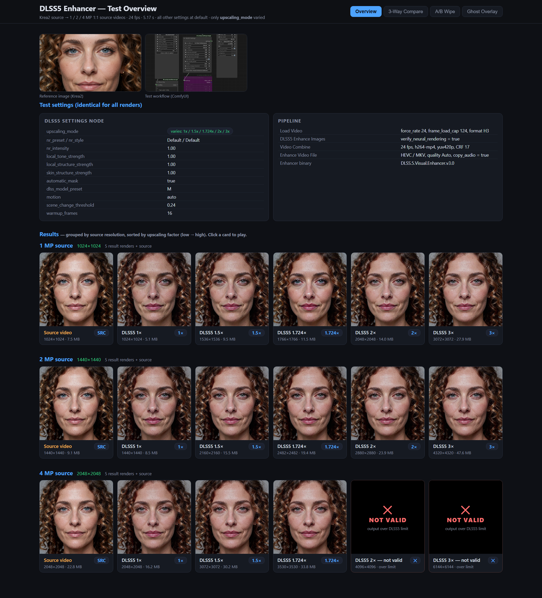
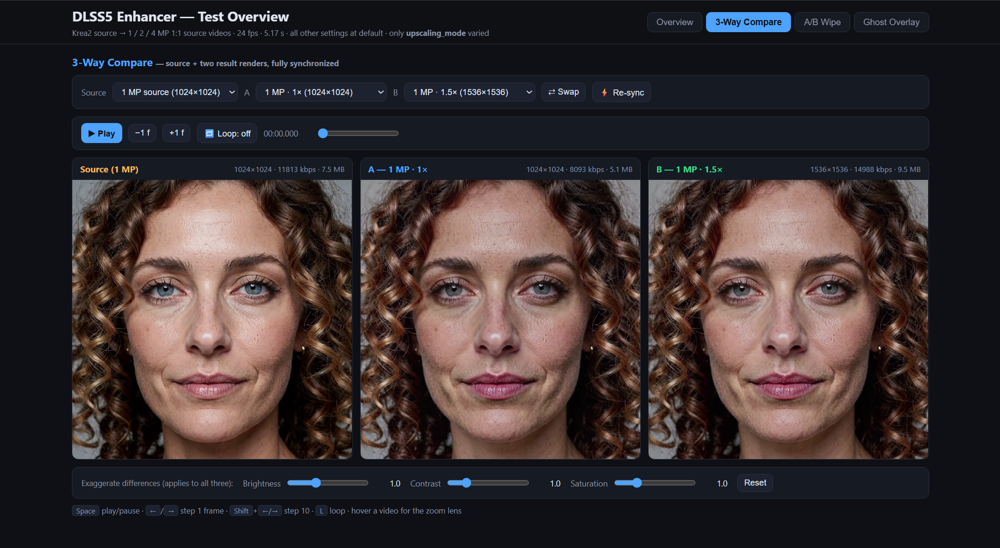
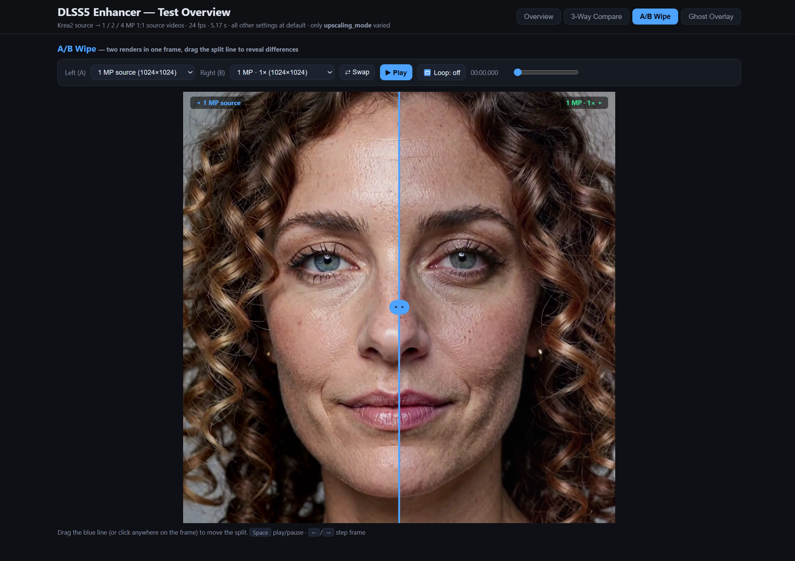
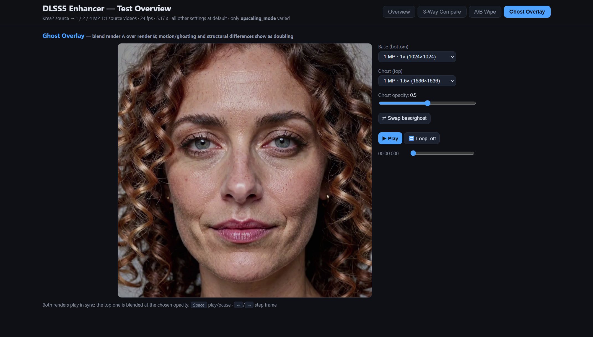

# DLSS5 Enhancer — Test Overview & Comparison

A self-contained HTML page that catalogs every DLSS5 Enhancer test render and
provides interactive tools to compare them side by side.

**Open `index.html` in any modern browser — no server, no dependencies.**
Everything in this folder (page, videos, images, this manual) is designed to
live together; just copy or clone the folder and open `index.html`.

## How to run

1. **Download the repo as a ZIP** (GitHub → Code → Download ZIP) or
   `git clone https://github.com/WackyWindsurfer/DLSS5-Testing.git`
2. **Unpack / extract** the folder anywhere on your machine
3. **Double-click `index.html`** — it opens directly in your browser.
   No server, no installation, no internet connection required; the page
   has zero external dependencies and references all videos/images by
   relative path within the folder.

The folder is fully portable — it also works from a USB stick or when
shared as a zip.



## What was tested

Source videos are 1:1 square clips (24 fps, 5.17 s) generated from a Krea2
reference image (`krea2-source_.png`). All renders used the same ComfyUI
workflow (see `DLSS5-Enhancer test setup.png`):

```
Load Video → DLSS5 Settings → DLSS5 Enhance Images → Video Combine (h264, CRF 17, 24 fps)
```

All DLSS5 settings were left at **default** (nr preset/style Default,
intensities 1.00, model preset M, motion auto, warmup 16,
scene_change_threshold 0.24). **Only `upscaling_mode` varied.**

| Source | Source res | upscaling_mode values | Output res range |
|---|---|---|---|
| 1mp | 1024×1024 | 1x, 1.5x, 1.724x, 2x, 3x | 1024 → 3072 |
| 2mp | 1440×1440 | 1x, 1.5x, 1.724x, 2x, 3x | 1440 → 4320 |
| 4mp | 2048×2048 | 1x, 1.5x, 1.724x, 2× & 3× (over limit) | 2048 → 3530 |

**File naming convention:** `<mp> DLSS5 <factor>x defaults.mp4` — e.g.
`2mp DLSS5 3x defaults.mp4` = the 2 MP source rendered with
`upscaling_mode = 3x`. Source videos: `<mp> source.mp4`.

> [!warning] Over-limit renders
> The 4 MP source at 2× (4096×4096) and 3× (6144×6144) **exceed the
> DLSS5 Enhancer's output-resolution limit** and did not produce valid
> results. On the page they appear as **NOT VALID** placeholder cards in
> the Overview, and are **excluded** from all compare/wipe/ghost
> dropdowns.

## The four tabs

### 1. Overview
- Reference image and workflow screenshot (click either to open the lightbox).
- The full settings table used for all renders.
- A row of cards per source resolution, sorted by upscaling factor
  (low → high) — all cards of the same MP size sit on one horizontal line.
  Each card shows a live first-frame thumbnail, the factor,
  output resolution, and file size.
- **Click a card** → modal player with scrubber, speed control, loop, and
  fullscreen. "Use in 3-Way Compare" drops that render into slot A.
- **NOT VALID placeholder cards** mark over-limit renders (4mp 2×, 4mp 3×)
  — they are not playable and are excluded from every comparison dropdown.

### 2. 3-Way Compare (the main tool)
- **Source dropdown:** the 3 source videos only (1mp / 2mp / 4mp).
- **A and B dropdowns:** all 13 valid result videos across all groups
  (broken/over-limit renders are excluded), labeled clearly, e.g.
  `2 MP · 3× (4320×4320)`.
- The three players are fully synchronized:
  - master play/pause + shared scrubber
  - frame-accurate stepping (±1 / ±10 frames)
  - loop toggle, A/B swap, re-sync button (if a player drifts)
- **Exaggeration controls** (brightness / contrast / saturation) applied to all
  three players — crank contrast to make subtle differences visible.
- **Zoom lens:** hover over any player for a 2.4× magnifier.



### 3. A/B Wipe
Two videos in one frame with a **draggable split line** (click anywhere on
the frame, or drag the blue handle). A (left of the line) and B (right of
the line) each offer **all 16 selectable videos** — the 3 sources plus all
13 valid result renders (broken/over-limit renders are excluded) — labeled
clearly, e.g. `2 MP source (1440×1440)` or `2 MP · 3× (4320×4320)`. Best
for spotting detail and structure differences.



### 4. Ghost Overlay
One video blended over another on a canvas with an **opacity slider**
(0–100%). **No Source dropdown:** base (bottom) and ghost (top) each offer
**all 16 selectable videos** — the 3 sources plus all 13 valid result
renders (broken/over-limit renders are excluded) — labeled clearly, e.g.
`2 MP source (1440×1440)` or `2 MP · 3× (4320×4320)`. Motion, ghosting,
and structural differences show up as doubling. Swap base/ghost to invert.



## Keyboard shortcuts (compare / wipe / ghost tabs)

| Key | Action |
|---|---|
| `Space` | play / pause |
| `←` / `→` | step 1 frame |
| `Shift` + `←` / `→` | step 10 frames |
| `L` | toggle loop |
| `Esc` | close modal / lightbox |

## Adding new renders

1. Drop the new `.mp4` into this folder (keep the naming convention).
2. Run `ffprobe` on it to get width/height/size:
   ```
   ffprobe -v error -select_streams v:0 -show_entries stream=width,height -show_entries format=size -of default=noprint_wrappers=1 "<file>.mp4"
   ```
3. Add an entry to the `GROUPS` object at the top of the `<script>` block in
   `index.html` (factor, file, w, h, size). Entries are sorted
   automatically, so just append.

## Folder contents

| File | What it is |
|---|---|
| `index.html` | the page (self-contained, inline CSS/JS) |
| `krea2-source_.png` | the Krea2 reference image the sources were made from |
| `DLSS5-Enhancer test setup.png` | the ComfyUI test workflow + settings screenshot |
| `screenshot-overview.png` | screenshot of the page (Overview tab) |
| `screenshot-3way-compare.png` | screenshot of the 3-Way Compare tab |
| `screenshot-ab-wipe.png` | screenshot of the A/B Wipe tab |
| `screenshot-ghost-overlay.png` | screenshot of the Ghost Overlay tab |
| `<mp> source.mp4` | the 3 source videos (1mp / 2mp / 4mp) |
| `<mp> DLSS5 <factor>x defaults.mp4` | the 13 valid test result renders (+ the broken 4mp 2x file) |
| `README.md` | this manual |
